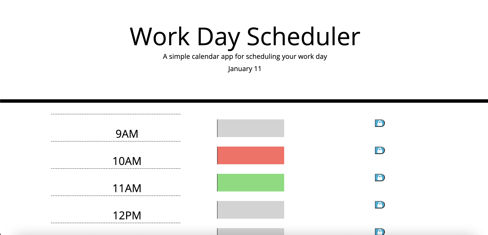

# work-day-scheduler

## Description

The purpose of this application is to create a Daily Work Scheduler for a busy client. The Scheduler will have color coded *textarea* elements that change depending on the time of day. It will also store the client's inputs in local storage so when they refresh the page the text will remain.

## Screen Shot

## Deployed Link

https://trevorsmithbanjo.github.io/work-day-scheduler/